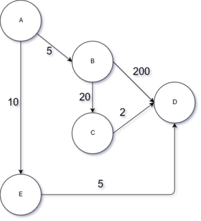

# Dijkstra-JS

## Information
This repository contains an implementation of the so called "Dijkstra's Shortest Path Algorithm" in JavaScript.
The advantage of this implementation from others is that it's rather simple and tiny due to the fact that both the dijkstra's algorithm as well as the path retrieving method are implemented using recursion.
## Test Example
In the Test folder you can view a simple usage of my implementation of the famous algorithm. In this specific case we have the following scenario:    
  
So in this case we want to start from vertex A and find the shortest path up to vertex D.
After feeding the data to the algorithm, it produces the following result (which is of course correct):
`D <- E <- A`

## Contributing
If you have any observations, you find something that is wrong or that it could be done better, then you are more than welcome to share your ideas and contributions with me.
